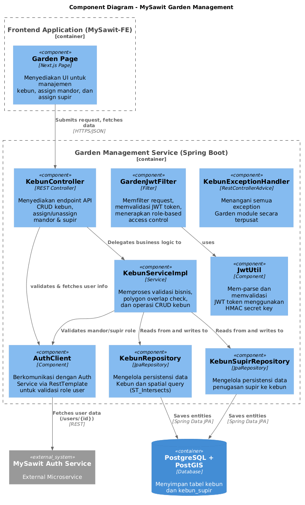
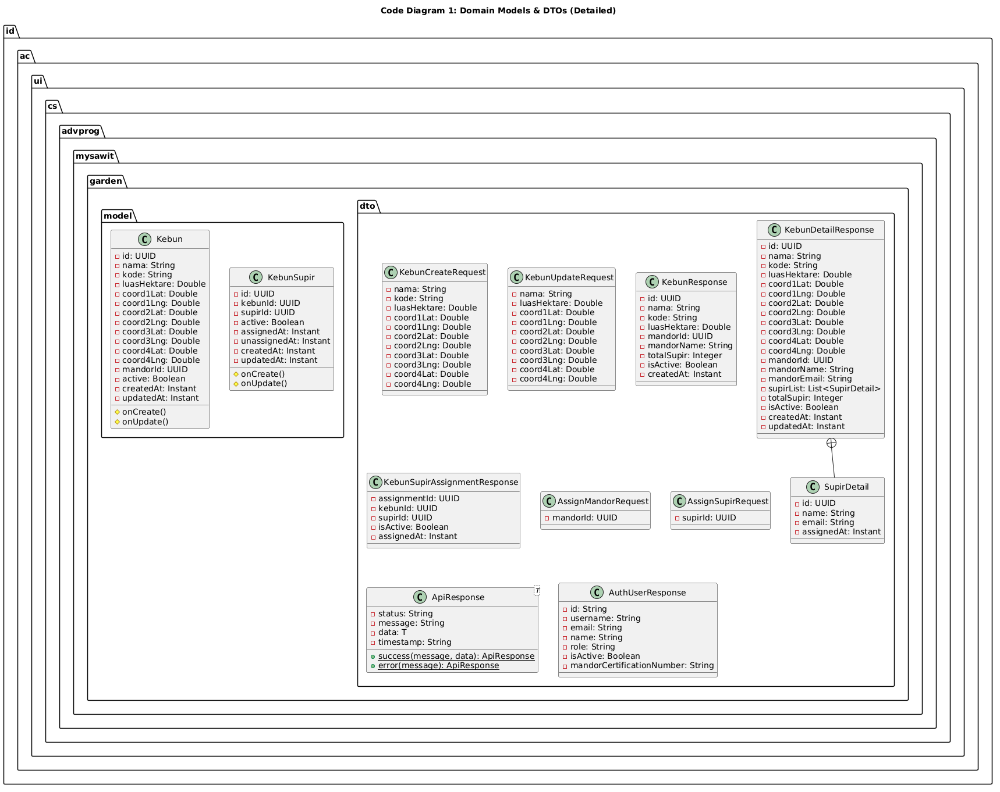
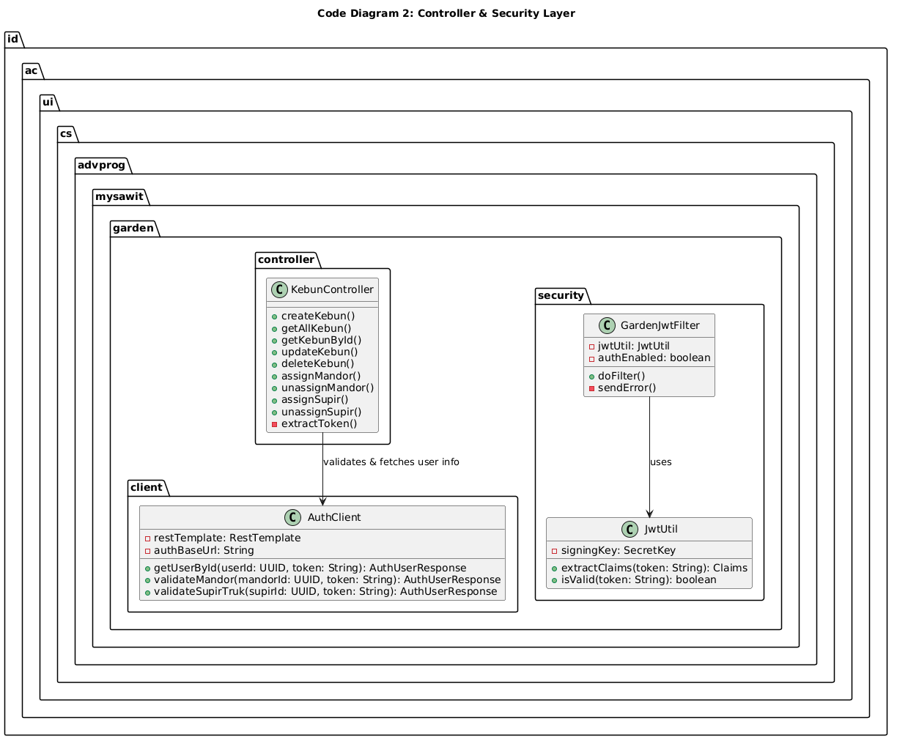
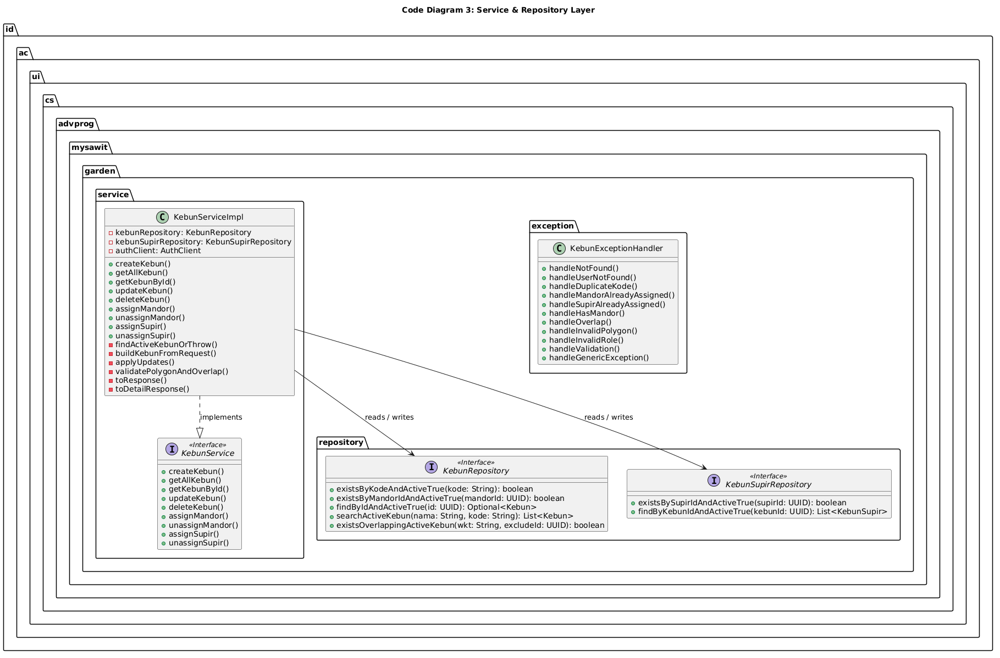

## 1. Harvest Management Module Diagram

Based on the group's container diagram, this section zooms into the **Harvest Management Service (MySawit-SAWIT)**.

### 1. Component Diagram
This diagram illustrates the internal components of the Harvest Management Service, including the Controller, Service, Repository, and their integrations with external adapters (Cloudinary, Auth Service, Payment Service).

### 2. Code Diagrams (Class Diagrams)
The following diagrams detail the class structures, attributes, and relationships within the Harvest Management module.

**Code Diagram 1: Domain Models & DTOs**

**Code Diagram 2: Controller & Security Layer**

**Code Diagram 3: Business Logic & Event-Driven Layer**

**Code Diagram 4: Repository & External Adapter Layer**

## 2. Manajemen Kebun / Garden Management - Amar Hakim
Berikut adalah **Component Diagram** dan **Code Diagrams** untuk bagian manajemen kebun (folder `garden`) yang saya kerjakan.

### Component Diagram

Diagram ini menunjukkan seluruh komponen dalam Garden Management Service beserta interaksinya dengan Frontend (MySawit-FE), Database (PostgreSQL + PostGIS), dan External Service (MySawit Auth Service).

### Code Diagrams
Diagram-diagram di bawah ini menunjukkan struktur class/interface di level kode dari modul Garden, dipisahkan berdasarkan layer:

1. **Code Diagram 1 — Domain Models & DTOs**: Menampilkan seluruh entity (`Kebun`, `KebunSupir`) dan DTO (`KebunCreateRequest`, `KebunUpdateRequest`, `KebunResponse`, `KebunDetailResponse`, `ApiResponse`, `AuthUserResponse`, dll.) beserta atribut lengkapnya.

2. **Code Diagram 2 — Controller & Security Layer**: Menampilkan `KebunController` dengan semua endpoint REST-nya, `GardenJwtFilter` untuk autentikasi JWT dan role-based access control, `JwtUtil` untuk parsing token, dan `AuthClient` untuk komunikasi dengan Auth Service.

3. **Code Diagram 3 — Service & Repository Layer**: Menampilkan interface `KebunService`, implementasinya `KebunServiceImpl` dengan seluruh business logic (validasi polygon, overlap check, assign mandor/supir), `KebunRepository` dengan spatial query, `KebunSupirRepository`, dan `KebunExceptionHandler` untuk centralized error handling.

