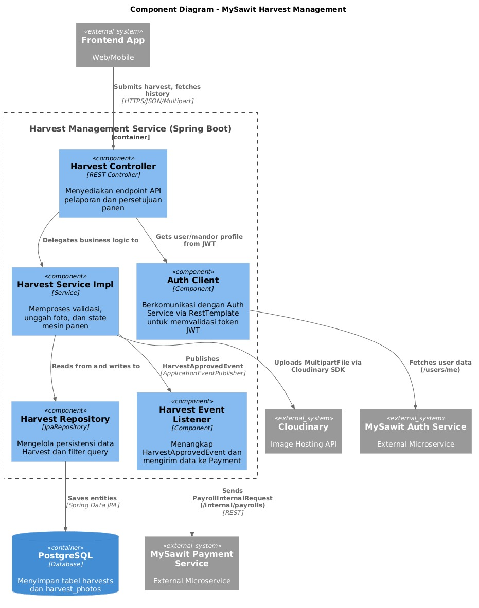
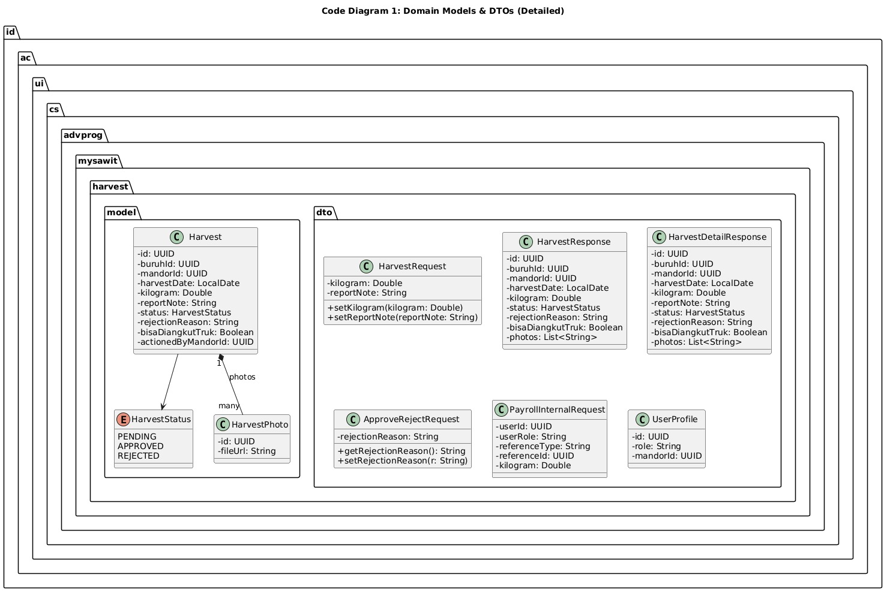
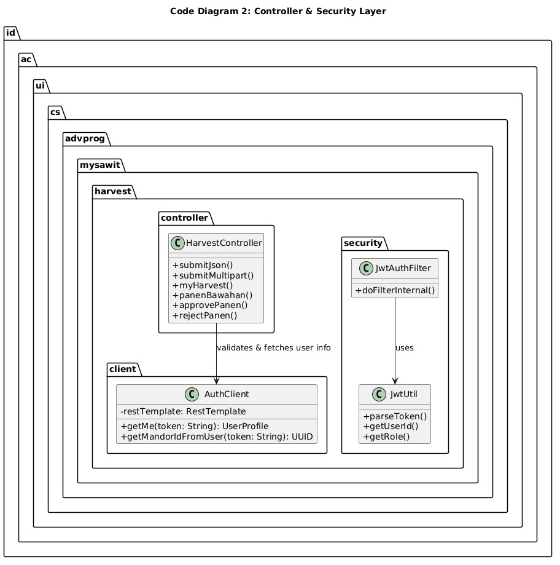
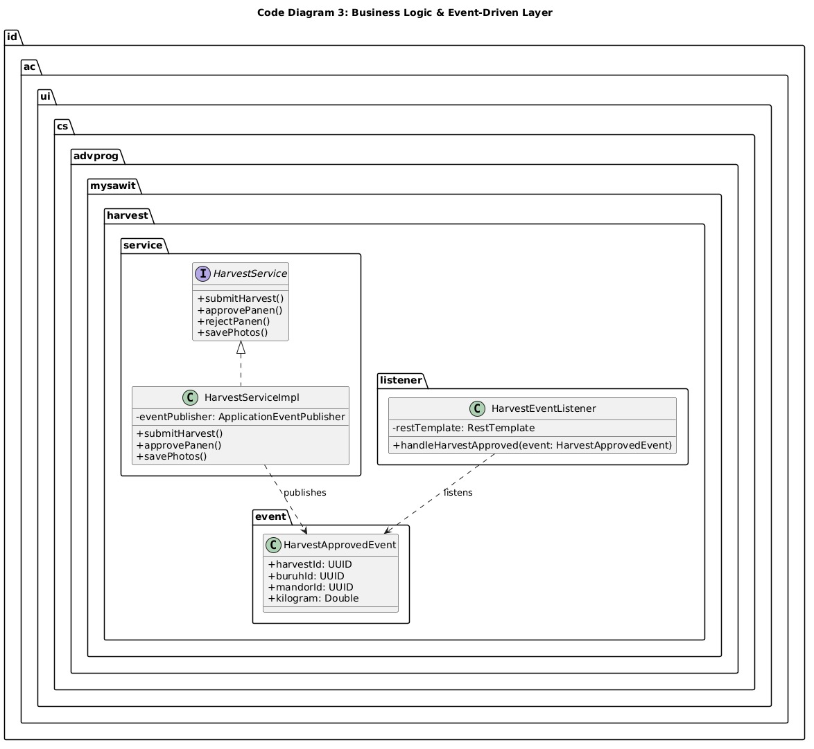
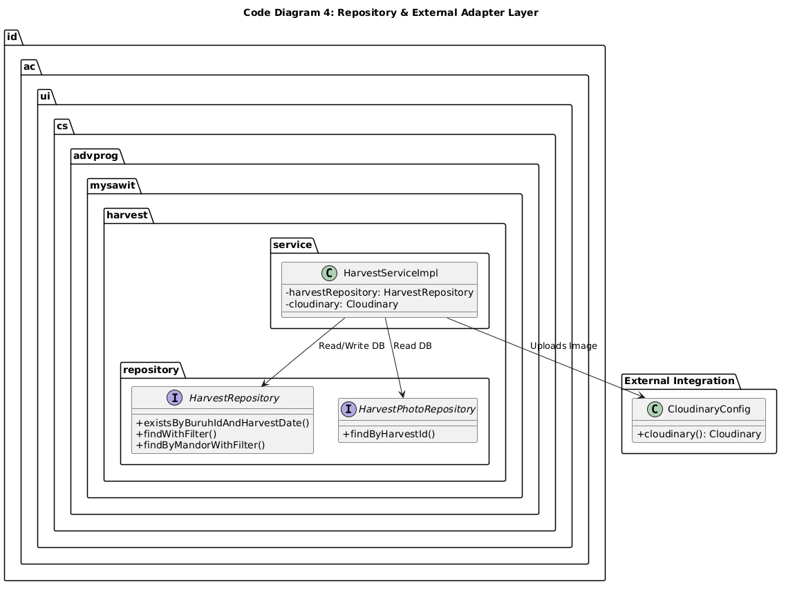

## 1. Harvest Management Module Diagram

Based on the group's container diagram, this section zooms into the **Harvest Management Service (MySawit-SAWIT)**.

### 1. Component Diagram
This diagram illustrates the internal components of the Harvest Management Service, including the Controller, Service, Repository, and their integrations with external adapters (Cloudinary, Auth Service, Payment Service).

### 2. Code Diagrams (Class Diagrams)
The following diagrams detail the class structures, attributes, and relationships within the Harvest Management module.

**Code Diagram 1: Domain Models & DTOs**

**Code Diagram 2: Controller & Security Layer**

**Code Diagram 3: Business Logic & Event-Driven Layer**

**Code Diagram 4: Repository & External Adapter Layer**
